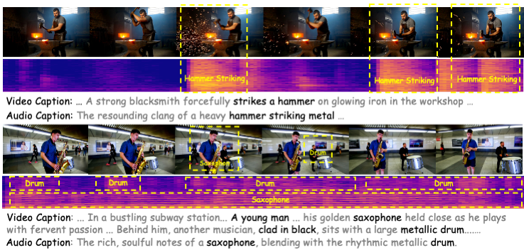

# Taming Text-to-Sounding Video Generation via Advanced Modality Condition and Interaction

> This repository is the anonymous code repository for the ICLR 2026 submission 'Taming Text-to-Sounding Video Generation via Advanced Modality Condition and Interaction'.



Demo Page: https://bridgedit-t2sv.github.io/

- We first propose the Hierarchical Visual-Grounded Captioning (HVGC) framework that generates pairs of disentangled captions, a video caption  and an audio caption, eliminating interference at the conditioning stage.
- Based on HVGC, we further introduce BridgeDiT, a novel dual-tower diffusion transformer, which employs a Dual CrossAttention (DCA) mechanism that acts as a robust  "bridge" to enable a symmetric, bidirectional exchange of information, achieving both semantic and temporal synchronization.

# Quick Start

First,  we build our environment.

```bash
bash setup.sh
```

## 1. Hierarchical Visual-Grounded Captioning (HVGC) framework 

```bash
conda activate hvgc
python hvgc.py
	--video_path <video_path> \
	--mllm_path <mllm_path> \
	--llm_path <llm_path> \
	--output_file <out_file>
```

## 2. Start to Train Bridgedit

1. Prepare Your Dataset and modify your `bridgedit/dataset/dataset_va.py`

2. download pretrained models

   ```bash
   bash download.sh
   ```

3. config your training setting in `bridgedit/config/train.yaml`
4. Start training

```bash
conda activate bridgedit
cd bridgedit
python main.py
```

```python
train_avsync() # for avsync
train_vgg_ss() # for vgg_ss
train_landscape() # for landscape
```

## 3. Inference

```
cd bridgedit
python infer.py \
	--video_prompt <v_prompt> \
	--audio_prompt <a_prompt> \
	--save_file <save_file> \
	--ckpt_path <ckpt_path> 
```

